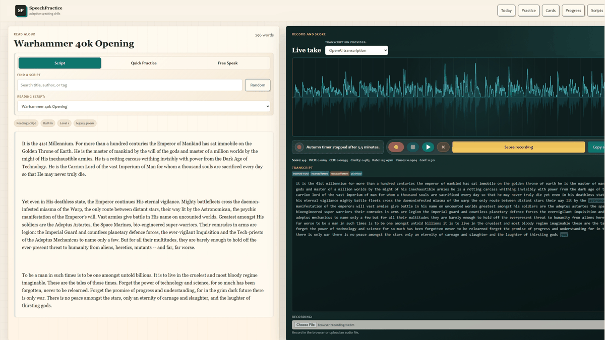
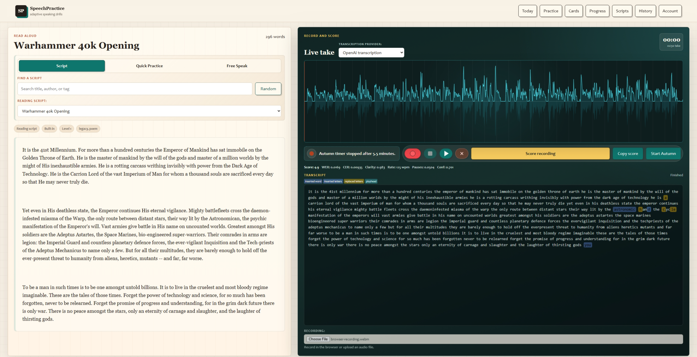
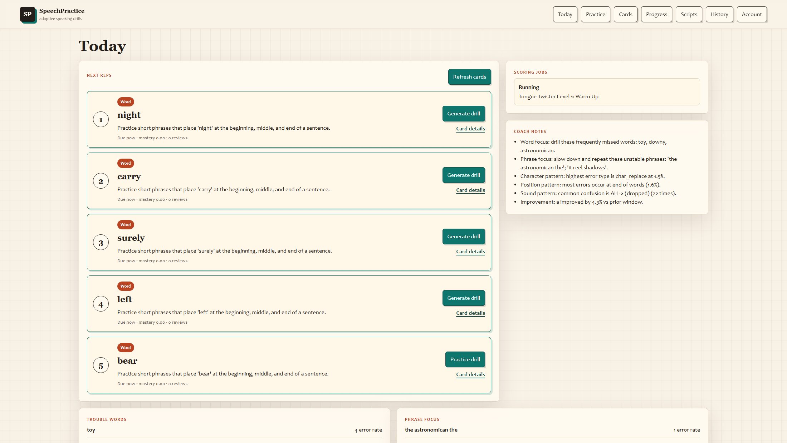
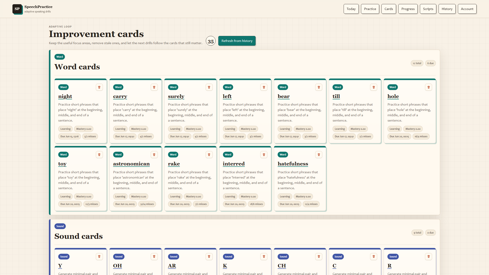
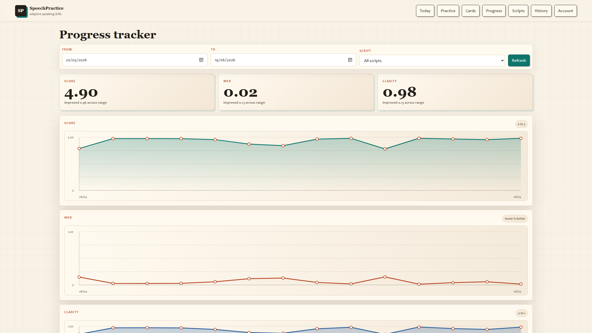

# SpeechPractice

SpeechPractice is a local Django web app for deliberate speaking practice. It gives you a script, records a take in the browser, transcribes it, scores it, and turns recurring mistakes into the next set of drills.



## What It Does

- Practice in three modes: scripted read-aloud, quick drills, or free speak.
- Record in the browser or upload audio for scoring.
- Transcribe with Local Whisper, OpenAI transcription, or a sidecar transcript for smoke tests.
- Score takes with WER, CER, clarity, speaking rate, pause ratio, confidence, and filled-pause metrics.
- Review clickable timestamped transcripts, waveform playback, highlighted errors, report exports, and editable transcripts.
- Build an adaptive practice loop from history, spaced-repetition cards, generated drills, ladders, and coach notes.
- Configure model providers, Codex auth, encrypted API keys, and local Whisper tuning from the Account page.

## Screenshots

| Practice workbench | Today queue |
| --- | --- |
|  |  |

| Cards | Progress |
| --- | --- |
|  |  |

The current branch is the Django rebuild. The old Qt desktop GUI has been removed; use `manage.py` or `run_server.bat` to run the web app.

## Requirements

- Python 3.10-3.12. This checkout usually uses `.venv312`.
- `ffmpeg` on `PATH` for Whisper and audio conversion.
- Optional NVIDIA CUDA-capable GPU plus a matching PyTorch build for faster local Whisper.

## Setup

```powershell
python -m venv .venv312
.\.venv312\Scripts\python.exe -m pip install --upgrade pip
.\.venv312\Scripts\python.exe -m pip install -r requirements.txt
```

For CUDA-enabled local Whisper, install the PyTorch wheel that matches your machine from the official PyTorch selector, then set the Whisper device or preset in Account.

## Run

Double-click:

```text
run_server.bat
```

For phone or tablet recording over the local network, use HTTPS. Browsers do not expose the microphone to plain LAN HTTP pages such as `http://192.168.x.x:8000/`.

```text
run_https_server.bat
```

The HTTPS launcher prints a local certificate authority file from `.certs/`. Install and trust that certificate on the phone once, then open the printed `https://<your-computer-ip>:8443/` address.

Or run manually:

```powershell
.\.venv312\Scripts\python.exe manage.py migrate
.\.venv312\Scripts\python.exe manage.py runserver 0.0.0.0:8000
```

Then open:

- Local: `http://127.0.0.1:8000/`
- LAN: `http://<your-computer-ip>:8000/`

## Daily Workflow

1. Open Today and pick the next due card or drill.
2. Record a take on Practice.
3. Score it, listen back, and inspect transcript highlights.
4. Use Cards and Progress to decide what needs another pass.

## Useful Commands

```powershell
.\.venv312\Scripts\python.exe manage.py check
.\.venv312\Scripts\python.exe manage.py test
.\.venv312\Scripts\python.exe manage.py refresh_cards
.\.venv312\Scripts\python.exe manage.py process_scoring_jobs
```

## Local Data

Development data is intentionally local and ignored by git:

- `sessions.db`
- `recordings/`
- `reports/`
- `settings.json`
- `script_index.json`
- `scripts/`

## Design Review

I keep a browser-captured backlog of visual and functional rough edges in [docs/rough_edges_plan.html](docs/rough_edges_plan.html). It is meant to be opened directly in a browser and used as a future implementation checklist, especially for the smaller-screen layouts that need a proper pass.

## Notes

- Local Whisper model instances are cached process-wide and can be cleared from the Account page after tuning changes.
- The sidecar transcript provider is useful for smoke tests: upload or point at an audio path with a sibling `.txt` transcript.
- See `SMOKE_TEST_CHECKLIST.md` for manual checks after touching recording, transcription, playback, or export flows.

## Production Deployment

The free Render shape is a single free web service, Neon Postgres, private AWS
S3 media, and OpenAI `whisper-1` transcription. See
`DEPLOYMENT_CHECKLIST.md` and `render.yaml` for the complete setup contract.
Render does not offer free background workers, so the free Blueprint processes
scoring in a background thread inside the web service. For more durable
production scoring, add back the worker service and use `SCORING_JOBS_MODE=queue`
on a paid Render instance.

Before exporting existing SQLite data, copy legacy audio into the configured S3
bucket and update its stored references:

```powershell
$env:USE_S3="1"
$env:AWS_STORAGE_BUCKET_NAME="your-private-bucket"
$env:AWS_S3_REGION_NAME="eu-north-1"
.\.venv312\Scripts\python.exe manage.py migrate_audio_storage --dry-run
.\.venv312\Scripts\python.exe manage.py migrate_audio_storage
```

Then export application data locally and import it after migrating the fresh
Neon database:

```powershell
.\.venv312\Scripts\python.exe manage.py dumpdata practice --exclude practice.PracticeSettings --indent 2 --output deployment-data.json
python manage.py loaddata deployment-data.json
```

`PracticeSettings` is intentionally excluded so local encrypted tokens and machine-specific settings are not moved into
production. Configure
`OPENAI_API_KEY` in Render and create the production account with `python
manage.py createsuperuser` from the Render shell.

The bucket remains private and audio is proxied through authenticated Django
views, so S3 CORS or public-read access is not required. A least-privilege IAM
policy template is available at `deploy/aws-s3-iam-policy.json`.
